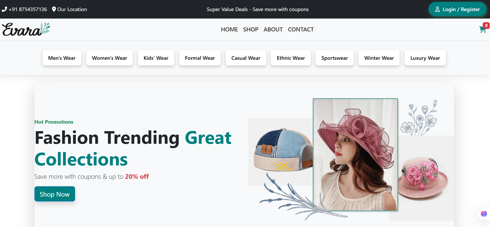

<h1 align ="center">RESPONSIVE E-COMMERCE - EVARA</h1>
<h2><a href="https://hyperdevil-x.github.io/Woodmart/" target="_blank">Website Link</a></h2>

 <h3  align ="center"><b>EVARA- A E-Commerce Website Using HTML5,CSS3,JAVASCRIPT.BOOTSTRAP V5.3</b></h3>
  

I am eager to share the successful completion of a fully responsive e-commerce project, which I developed using HTML, CSS, JavaScript, Bootstrap. This project showcases my technical skills in front-end development and my ability to implement key e-commerce features effectively.

<ul>
 <h2><b> Pages </b></h2>
 <li>Home</li>
 <li>Shop</li>
 <li>About</li>
 <li>Contact</li>
 <li>Login/Register</li>
 <li>Checkout</li>
 <li>Payment</li>
 <li>Payment Success</li>

 <h2><b> Key Features </b></h2>
 <li>🖼️ Product Image Swiper</li>
 <li>📸 Product Image Slider</li>
 <li>🛒 Categories Menu List Dropdown</li>
 <li>📧 Newsletter Subscription</li>
 <li>🔍 Product Filter (Categories and Sub-categories) Dynamically</li>
 <li>💰 Price Range Filter Dynamically</li>
 <li>🎁 Pop-up Add to Cart</li>
 <li>🛒 Product Update in Cart Dynamically Using LocalStorage</li>
 <li>🛍️ Fetch Cart Products on Checkout Page</li>
 <li>🗑️ Remove Added Cart Products</li>
 <li>🏠 Separate Billing & Shipping Address Forms</li>
 <li>💳 Multiple Payment Methods</li>
 <li>📄 Order Details in Order Summary</li>
 <li>✅ Payment Success Message: "Your payment has been successfully processed. Thank you for your order."</li>
 
 <h1><b> Technologies <b></h1>
<h2><b>Front-End</b></h2>
<li>HTML5</li>
<li>CSS3</li>
<li>JAVASCRIPT</li>
<li>BOOTSTRAP V5.3</li>
</ul>

